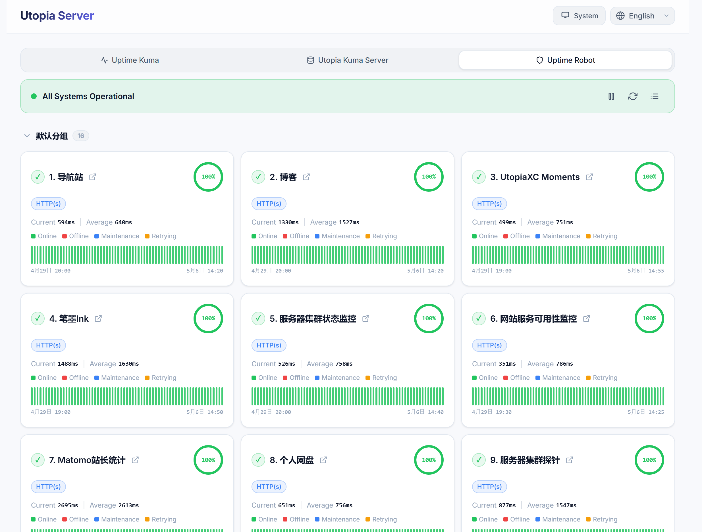

# Utopia Uptime Page

Languages: [English](README_en.md) | [简体中文](README_zh_CN.md) | **繁體中文** | [日本語](README_ja.md)

一個網站可用性監控面板的展示前端，支援 [Uptime Robot](https://uptimerobot.com/) 與 [Uptime Kuma](https://uptimekuma.org/)，純靜態部署。  
你可以訪問 [DEMO](https://status.utopiaxc.cn/)

## 1. 功能
- **多資料源聚合**：支援將多個 Uptime Robot 和 Uptime Kuma 的監控項目集中在同一個面板展示。
- **視覺化配置**：內建獨立配置生成器 (`config-generator.html`)，點擊介面即可生成配置，免去手寫程式碼的困擾。
- **Kuma 多功能資料庫腳本**：附帶可選的 Python FastAPI 後端 (`Utopia Kuma Server`)，可直連 Kuma 資料庫，徹底解決 Kuma 公開 API 的跨域問題及心跳記錄限制。
- **i18n 支援**：原生提供對英文、簡體中文、繁體中文和日語的支援。



## 2. 部署

### 2.1 前端部署
1. 從 [Releases](https://github.com/UtopiaXC/UtopiaUptimePage/releases) 頁面下載最新編譯好的發行版。
2. 解壓縮後將 `/dist` 資料夾託管至任何靜態伺服器（Nginx, Vercel, GitHub Pages 等）。

### 2.2 config 生成與設定
1. 訪問你的網址加上 `/config-generator.html`。
2. 按照介面提示生成配置。
3. 儲存生成的結果為 `config.js`，並放入網站根目錄。

### 2.3 Utopia Kuma Server（可選）
此可選伺服器用於作為 Uptime Kuma 實例的橋樑，可解決其公開 API 的跨域 (CORS) 問題。當運行在資料庫直連模式下，它能直接讀取 Kuma 的資料庫，突破預設最多 100 條心跳資料的限制，讓前端可以展示更多天數的歷史可用性資料。

#### 2.3.1 直接運行
請確保首先將 `.env.example` 複製為 `.env` 並自行設定環境變數。
```bash
cd server
pip install -r requirements.txt
python server.py
```

#### 2.3.2 docker 運行
無需本地編譯，直接拉取預先建置的映像檔並掛載你的資料目錄即可運行：
```bash
docker run -d \
  --name utopia-server \
  -p 55520:55520 \
  -v /你的/uptime-kuma/data/目錄:/data \
  utopiaxc1025/utopia-kuma-server
```

## 3. 鳴謝
感謝 [Uptime Robot](https://uptimerobot.com/) 與 [Uptime Kuma](https://uptimekuma.org/) 提供的優秀監控服務。
另外，特別感謝 [Kuma Mieru](https://github.com/alice39s/kuma-mieru) 專案，我們在 UI 與理念上部分借鑒了該專案。

## 4. 免責
本專案遵循 MIT 開源協議。
本專案使用 Antigravity 與 Claude Opus、Gemini Pro 進行 "vibe" 開發。

## 5. 捐贈
請不要在任何管道以任何方式為本專案付出金錢。
如果您想捐助本專案，您可以向慈善組織或開放原始碼促進會（開源組織，OSI）捐款，我們會感激不盡。

---
*本文檔由 Gemini 3.1 Pro 生成。*
